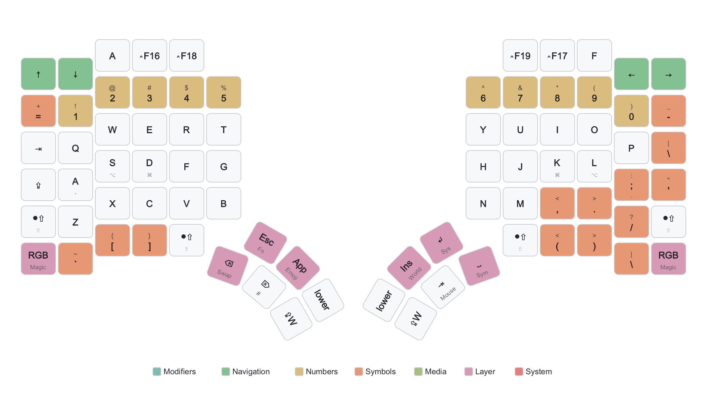
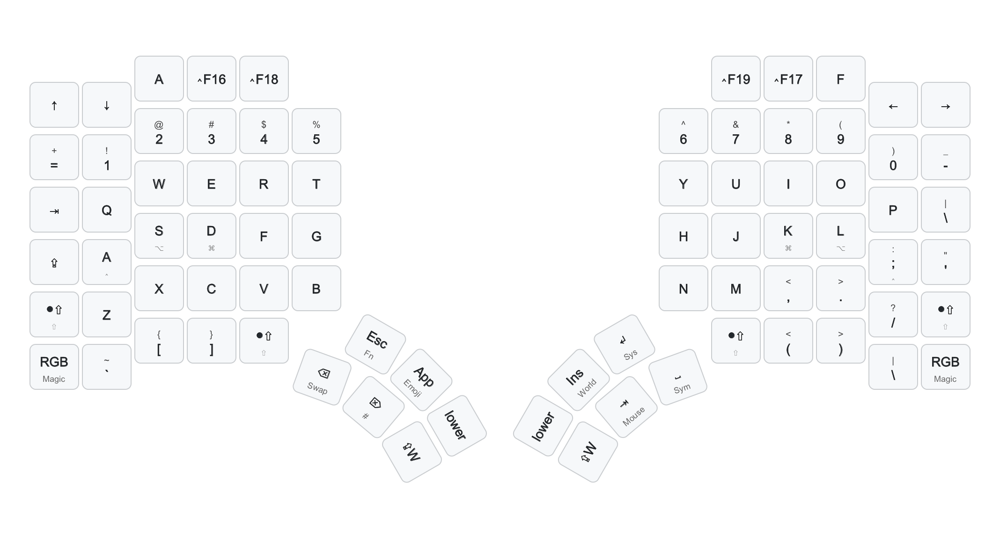

# Glove80 Keymap Visualizer

Generate beautiful PDF visualizations of your Glove80 keyboard layers from ZMK keymap files.


[](https://pypi.org/project/glove80-keymap-visualizer/)
[](https://github.com/dsifry/glove80-keymap-visualizer/actions/workflows/ci.yml)
[](https://coderabbit.ai)


## What It Does

This tool takes your ZMK `.keymap` file (exported from the [MoErgo Glove80 Layout Editor](https://my.glove80.com/)) and generates a PDF document with a visual diagram for each layer—similar to [sunaku's layer diagrams](https://sunaku.github.io/moergo-glove80-keyboard-layers.pdf).

## Example Output

**With `--color` flag** (semantic coloring by key category):



**Plain output** (no color coding):



## Getting Started

### Step 1: Install System Dependencies

**macOS:**
```bash
brew install cairo
```

**Ubuntu/Debian:**
```bash
sudo apt-get install libcairo2-dev
```

**Windows:**
See [CairoSVG installation docs](https://cairosvg.org/documentation/#installation) for Windows instructions.

### Step 2: Install the Tool

**Option A: Install from PyPI (recommended)**
```bash
pip install glove80-keymap-visualizer
```

**Option B: Install from source**
```bash
git clone https://github.com/dsifry/glove80-keymap-visualizer.git
cd glove80-keymap-visualizer
pip install .
```

### Step 3: Export Your Keymap

1. Go to [my.glove80.com](https://my.glove80.com/)
2. Load your layout
3. Click **Export** → **Download ZMK Keymap**
4. Save the `.keymap` file

### Step 4: Generate Your PDF

```bash
# Basic usage - generates a PDF with all layers
glove80-viz your-keymap.keymap -o my-layers.pdf

# With color coding (recommended!)
glove80-viz your-keymap.keymap -o my-layers.pdf --color
```

That's it! Open `my-layers.pdf` to see your keyboard layout.

## Common Options

```bash
# Color-coded keys by category (modifiers, navigation, etc.)
glove80-viz keymap.keymap -o output.pdf --color

# Color-coded without the legend
glove80-viz keymap.keymap -o output.pdf --color --no-legend

# Windows modifier symbols (Win, Ctrl, Alt, Shift) instead of Mac symbols
glove80-viz keymap.keymap -o output.pdf --windows

# Show what keys do on transparent layers (instead of "trans")
glove80-viz keymap.keymap -o output.pdf --resolve-trans

# Generate only specific layers
glove80-viz keymap.keymap -o output.pdf --layers Base,Symbol,Cursor

# Generate SVG files instead of PDF
glove80-viz keymap.keymap -o ./svg-folder --format svg

# List all available layers in your keymap
glove80-viz keymap.keymap --list-layers
```

## Features

- **OS-specific modifier symbols** — Mac (⌘⌥⌃⇧), Windows (Win+Ctrl+Alt+Shift), or Linux (Super+Ctrl+Alt+Shift)
- **Semantic coloring** — Color-code keys by category: modifiers, navigation, numbers, symbols, media, layers, system
- **Color legend** — Shows what each color means (can be hidden with `--no-legend`)
- **Held key indicators** — Shows which key you hold to activate each layer
- **MEH/HYPER expansion** — `MEH(K)` displays as `⌃⌥⇧K` on Mac
- **Transparent key resolution** — Optionally show inherited keys instead of "trans" markers
- **Table of contents** — PDF includes clickable TOC for easy navigation
- **Layer filtering** — Generate only the layers you want

## All CLI Options

| Option | Description |
|--------|-------------|
| `-o, --output` | Output file (PDF) or directory (SVG) |
| `--format` | Output format: `pdf` (default) or `svg` |
| `--layers` | Comma-separated list of layers to include |
| `--exclude-layers` | Comma-separated list of layers to exclude |
| `--list-layers` | List available layers and exit |
| `--config` | Path to YAML configuration file |
| `--mac` | Use Mac modifier symbols (⌘⌥⌃⇧) — default |
| `--windows` | Use Windows modifier symbols |
| `--linux` | Use Linux modifier symbols |
| `--color` | Apply semantic colors to keys |
| `--no-legend` | Hide color legend (use with `--color`) |
| `--resolve-trans` | Show inherited keys instead of "trans" |
| `--base-layer` | Base layer for `--resolve-trans` (default: first layer) |
| `--no-toc` | Disable table of contents in PDF |
| `--continue-on-error` | Continue if a layer fails to render |
| `-v, --verbose` | Show detailed output |
| `-q, --quiet` | Suppress all output except errors |

## Color Scheme

When using `--color`, keys are colored by category using an Everforest-inspired palette:

| Category | Color | Example Keys |
|----------|-------|--------------|
| Modifiers | Teal | ⌘, ⌥, ⌃, ⇧, Shift, Ctrl, Alt |
| Navigation | Green | ←, →, ↑, ↓, Home, End, PgUp, PgDn |
| Numbers | Yellow | 0-9, F1-F12 |
| Symbols | Orange | !@#$%^&*() etc. |
| Media | Light Green | ⏯, ⏭, 🔊, 🔇, brightness |
| Layer | Purple | Layer activators (held keys) |
| System | Red | Reset, Boot, Bluetooth keys |
| Mouse | Teal | Mouse movement and clicks |
| Transparent | Gray | Transparent/pass-through keys |

## Configuration File

For persistent settings, create a YAML config file:

```yaml
# my-config.yaml
os_style: mac          # "mac", "windows", or "linux"
show_colors: true
show_legend: true
resolve_trans: false
include_toc: true
page_size: letter      # or "a4"
orientation: landscape
```

Then use it:
```bash
glove80-viz keymap.keymap -o output.pdf --config my-config.yaml
```

## Development

```bash
# Install with dev dependencies
pip install -e ".[dev]"

# Run tests
pytest

# Run tests with coverage
pytest --cov

# Format code
ruff format .

# Lint
ruff check .
```

## How It Works

1. **Parse** — Uses [keymap-drawer](https://github.com/caksoylar/keymap-drawer) to parse ZMK keymap files
2. **Extract** — Extracts layer info, key bindings, hold behaviors, and layer activators
3. **Generate SVG** — Creates SVG diagrams with keymap-drawer's layout engine
4. **Convert to PDF** — Combines SVGs into a PDF with TOC using CairoSVG and pikepdf

## Credits

- [keymap-drawer](https://github.com/caksoylar/keymap-drawer) — ZMK keymap parsing and SVG generation
- [sunaku's Glove80 keymaps](https://github.com/sunaku/glove80-keymaps) — Inspiration for visualization format
- [MoErgo Glove80](https://www.moergo.com/) — The keyboard this tool is built for
- [Everforest](https://github.com/sainnhe/everforest) — Color palette inspiration

## License

MIT License — see [LICENSE](LICENSE) file for details.
